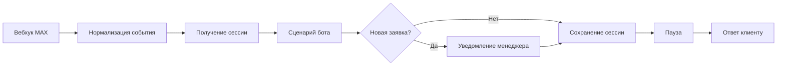

# MAX Lead Bot для мебельных фасадов

Портфолио-кейс Пулата Сафарова: автоматизация приёма заявок через бота в мессенджере MAX и workflow в n8n.

Подробное описание решения: [docs/CASE_STUDY.md](docs/CASE_STUDY.md).

## Задача

Сделать клиентский путь коротким: выбрать услугу, указать удобный способ связи и оставить контакт, не переводя менеджера на ручной разбор каждого сообщения.

## Что реализовано

- приветствие и выбор из четырёх услуг;
- два пути связи: запрос звонка или самостоятельный контакт;
- приём контакта из MAX с проверкой структуры контакта;
- нормализация событий MAX перед бизнес-логикой;
- сохранение сессий и заявок в n8n Data Tables;
- уведомление менеджера о новой заявке и подтверждение клиенту;
- защита от повторной обработки одного события;
- кнопки «В начало», «Назад» и создание следующей заявки;
- телефон менеджера и ссылка на её профиль MAX в ветке самостоятельной связи;
- один исходящий ответ клиенту на событие, даже если Data Table вернула несколько строк сессии.

## Схема

## Проверки

`npm test` запускает два чистых изолированных прогона логики: 800 синтетических пользовательских сценариев суммарно и 4 428 нормализованных событий. Проверяются оба пути связи, контакты MAX, повторы событий, произвольный ввод, навигация и создание новой заявки. Отдельно проверяется настройка `Execute Once` у узла «Ответ клиенту».

Это тесты JavaScript-логики из workflow. Они не обращаются к живому MAX API, не записывают данные в n8n и не подтверждают интеграционную работу импортированного workflow.

## Импорт и настройка

Публичный workflow намеренно выключен и обезличен. В нём удалены рабочие credential, идентификаторы webhook и таблиц, реальные контакты и персональные данные.

1. Импортируйте [`workflow/max-facade-pro.template.json`](workflow/max-facade-pro.template.json) в свою среду n8n.
2. Создайте отдельные credential для входящего webhook MAX и исходящих запросов Bot API.
3. Укажите собственные таблицы сессий и заявок в n8n Data Tables.
4. Замените значения `REPLACE_WITH_*`, включая уникальный путь webhook, имя и телефон менеджера, URL профиля менеджера (`REPLACE_WITH_MANAGER_MAX_URL`), ID менеджера MAX и контакт разработчика. ID для уведомлений берите из входящего события самого менеджера, а не из имени или ссылки профиля.
5. Укажите нужный часовой пояс вместо `Asia/Yekaterinburg`, если время в уведомлениях должно соответствовать другому региону.
6. Проверьте тестовые события на отдельном боте и тестовых таблицах. Только после этого включайте workflow.

Не импортируйте шаблон в рабочую среду без проверки таблиц и credential: схема содержит узлы отправки сообщений и сохранения заявок.

Если в таблице сессий уже есть несколько строк с одним `user_id`, Upsert может вернуть их все. Настройка `Execute Once` защищает отправку ответа от этого размножения, но сами дубли в таблице нужно отдельно разобрать и обеспечить уникальность сессии на пользователя.

## Стек

- n8n 2.33.4
- MAX Bot API
- JavaScript Code nodes
- n8n Data Tables

## Авторство и права

Автор кейса и реализации: **Пулат Сафаров**. Репозиторий опубликован как портфолио-кейс. Лицензия не предоставляется; все права сохранены за автором.
