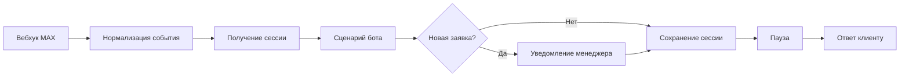

# MAX Lead Bot для мебельных фасадов

Портфолио-кейс Пулата Сафарова: автоматизация приёма заявок через бота в мессенджере MAX и workflow в n8n.

Подробное описание решения: [docs/CASE_STUDY.md](docs/CASE_STUDY.md).

## Задача

Сделать клиентский путь коротким: выбрать услугу, указать удобный способ связи и оставить контакт, не переводя менеджера на ручной разбор каждого сообщения.

## Что реализовано

- приветствие и выбор из четырёх услуг;
- два пути связи: запрос звонка или самостоятельный контакт;
- приём контакта из MAX с проверкой структуры контакта;
- нормализация событий MAX перед бизнес-логикой;
- сохранение сессий и заявок в n8n Data Tables;
- уведомление менеджера о новой заявке и подтверждение клиенту;
- защита от повторной обработки одного события;
- обработка кнопки для создания следующей заявки.

## Схема

## Проверки

`npm test` запускает два чистых изолированных прогона логики: 800 синтетических пользовательских сценариев суммарно и 4 414 нормализованных событий. Проверяются оба пути связи, контакты MAX, повторы событий, произвольный ввод и создание новой заявки.

Это тесты JavaScript-логики из workflow. Они не обращаются к живому MAX API, не записывают данные в n8n и не подтверждают интеграционную работу импортированного workflow.

## Импорт и настройка

Публичный workflow намеренно выключен и обезличен. В нём удалены рабочие credential, идентификаторы webhook и таблиц, реальные контакты и персональные данные.

1. Импортируйте [`workflow/max-facade-pro.template.json`](workflow/max-facade-pro.template.json) в свою среду n8n.
2. Создайте отдельные credential для входящего webhook MAX и исходящих запросов Bot API.
3. Укажите собственные таблицы сессий и заявок в n8n Data Tables.
4. Замените значения `REPLACE_WITH_*`, включая уникальный путь webhook, имя и телефон менеджера, ID менеджера MAX и контакт разработчика.
5. Укажите нужный часовой пояс вместо `UTC`, если время в уведомлениях должно соответствовать локальному.
6. Проверьте тестовые события на отдельном боте и тестовых таблицах. Только после этого включайте workflow.

Не импортируйте шаблон в рабочую среду без проверки таблиц и credential: схема содержит узлы отправки сообщений и сохранения заявок.

## Стек

- n8n 2.33.4
- MAX Bot API
- JavaScript Code nodes
- n8n Data Tables

## Авторство и права

Автор кейса и реализации: **Пулат Сафаров**. Репозиторий опубликован как портфолио-кейс. Лицензия не предоставляется; все права сохранены за автором.
