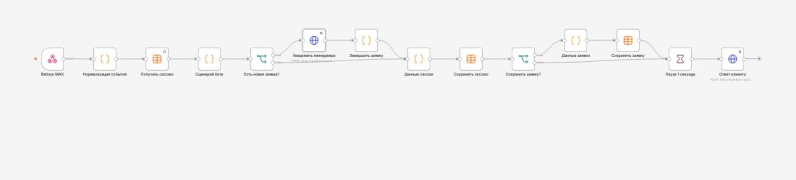
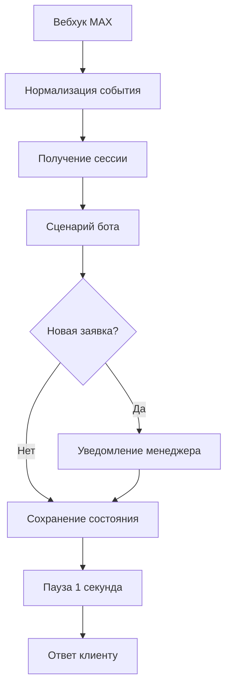

# MAX — Фасад PRO

Портфолио-кейс: бот в мессенджере MAX для приёма заявок на изготовление мебельных фасадов. Логика собрана в n8n и работает без ИИ-модели: быстро, предсказуемо и без лишних расходов на генерацию текста.

## Что умеет бот

- встречает клиента и показывает приветствие после естественной задержки;
- предлагает четыре вида мебельных фасадов;
- даёт выбрать звонок менеджера или самостоятельную связь;
- принимает контакт, отправленный штатной кнопкой MAX;
- сохраняет состояние диалога и заявку в Data Tables n8n;
- отправляет менеджеру услугу, имя, телефон и данные клиента в MAX;
- защищается от повторной обработки одного события;
- после оформления предлагает оставить новую заявку.

## Архитектура

## Сценарий клиента

1. Клиент запускает бота.
2. Получает приветствие и четыре кнопки услуг.
3. Выбирает способ связи.
4. Передаёт контакт MAX или получает контакты менеджера.
5. Бот сохраняет заявку, уведомляет менеджера и подтверждает обращение.

## Безопасность публичного шаблона

В шаблоне workflow нет токенов, ключей, credential ID, внутренних ID таблиц, реальных телефонов, реальных MAX ID или ссылок на личные профили. Настраиваемые значения заменены метками `REPLACE_WITH_*`. В тестах используются только синтетические данные.

Не добавляйте токен MAX прямо в workflow. Создайте отдельный Header Auth credential в n8n и выберите его в нужных нодах.

## Запуск

1. Импортируйте [`workflow/max-facade-pro.template.json`](workflow/max-facade-pro.template.json) в n8n.
2. Создайте два отдельных Header Auth credential:
   - входной секрет webhook MAX для ноды `Вебхук MAX`;
   - токен бота MAX для нод `Уведомить менеджера` и `Ответ клиенту`.
3. Не используйте один секрет одновременно для входного webhook и исходящих запросов Bot API.
4. Создайте две Data Tables и замените значения:
   - `REPLACE_WITH_SESSIONS_TABLE_ID` — таблица сессий;
   - `REPLACE_WITH_LEADS_TABLE_ID` — таблица заявок.
5. Замените остальные `REPLACE_WITH_*` на данные своего проекта.
6. Проверьте обе ветки сценария и только после этого публикуйте workflow.

### Поля таблицы сессий

`user_id`, `chat_id`, `stage`, `service`, `connection_method`, `name`, `phone`, `username`, `last_event_id`, `application_id`, `manager_notified`, `updated_at`.

### Поля таблицы заявок

`application_id`, `user_id`, `chat_id`, `name`, `phone`, `username`, `service`, `connection_method`, `created_at`, `manager_notified`, `status`.

## Проверка

Нормализация и бизнес-логика прошли два чистых изолированных прогона: 800 пользовательских сценариев и обе ветки. Проверены события `bot_started`, `message_created`, `message_callback`, контакт MAX, произвольный ввод, повторные события и создание новой заявки. Запуск: `npm test`.

Реальная работа зависит от корректных credential, webhook и настроек бота MAX в вашей среде.

## Стек

- n8n 2.33.4
- MAX Bot API
- JavaScript в Code-нодах
- n8n Data Tables

## Автор

Pulat Safarov — разработка ботов, сайтов и автоматизации для бизнеса.
